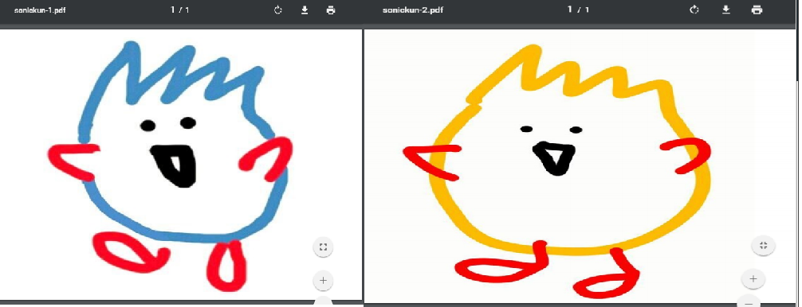
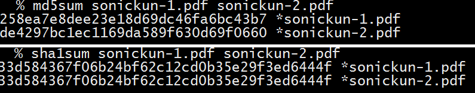

# sha1-collider
Generate two PDFs with different contents but identical SHA1 hashes.

任意の2つのJPEG画像を入力し、SHA-1ハッシュ値が一致する衝突PDFを生成するスクリプトです。

Googleが成功したSHA-1の[Identifical-prefix Collision Attack](https://security.googleblog.com/2017/02/announcing-first-sha1-collision.html)により得られたNear-collision pairを利用しています。

画像のアスペクト比は自由ですが、2つの画像のサイズは一致している必要があります（異なる場合、2枚目の画像を1枚目の画像サイズに自動的にリサイズします）。

画像サイズは65kB以下である必要があります（JPEGのコメントセグメントを連結することによって上限を増やすことは可能）。


# Usage
```sh
$ python collider.py a.jpg b.jpg
```
Requirements
- PIL
- PyCrypto


# Sample Output




